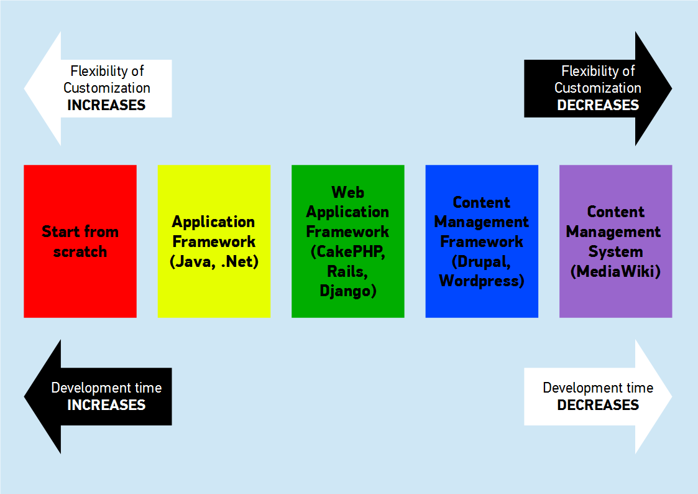

# Introduction to Drupal


## Agenda

* What is Drupal?
* Why Drupal?
* Create your first Drupal Website
* How Drupal works?
  * Content Type & Node | Block | Module | Views | Theme
* Development Tools


# What is Drupal?


## Drupal is ...

* A ready-to-go platform for building websites or web applications
* Open source (GPLv2)
* Content Management System / Content Management Framework
* Developed by Dries Buytaert in 2001


# Where Drupal lies in Software Engineering?





## We can use Drupal to build

* Personal websites
* Community websites
* Company websites
* Online shops
* Any web applications


# Why Drupal?


## Overview (As of August 2013)

* Over 980,000 registered users on [drupal.org][1]
* About 28,000 of them are developers
* Almost 23,000 contributed modules and themes
* 2% of top million sites are built on Drupal ([BuiltWith][2])

[1]: https://drupal.org "Drupal"
[2]: http://trends.builtwith.com/cms/Drupal "BuiltWith Web Technology Usage Statistics"


## Business point of view

* Free to use
* Promising technology with large community backup
* Cut down development time
* Well tested and safe to use
* Regular security update avaiable
* Easy for the team to pick up


## Technical point of view

* CMS ready
* Moduler architecture
* 28,000 contributed modules ready-to-use
* Inversion of Control
* Clear cut between program logics and theme functions
* Powerful API for building different kind of web applications
* Good community support
* Good documentation
* Intact API reference


## Learning Curve

```
proficiency
  |                                       __ ----- Various web applications
  |                                    __/
  |                                 __/
  |                              __/
  |                           __/
  |                        __/
  |               ________/                  ----- Community websites, Online shops
  |              /
  |       ______/
  |   ___/                                   ----- Personal/Company websites
  |  |
  |  |
  |  |
  |_/_______________________________________
                    time
```


# Create your first Drupal Website


* Create a free Drupal website on [Drupal Garden][1]
* Very limited modules are available
* No custom module and theme
* Only frontend (GUI) is accessible
* Good for non-developer

[1]: http://www.drupalgardens.com/ "Drupal Garden"


# How Drupal works?


## Module Overview

* Modules are pluggable
* It is a collection of PHP files
* Sometimes including Javascript and CSS
* Provide new features and functions

<br>

## Theme Overview

* Theme is responsible for the layout and style
* It is the design implementation
* Pick a ready-to-use theme OR develop from blank starter theme 


## Content Type & Node

* A website is composed of different types of content
* For example: _Blog post_, _News_, _Course_... etc
* Each piece of content is regarded as a __node__
* __Node__ is the basic content unit
* __Content type__ defines the structure and properties of the __nodes__
* Each __node__ belongs to a __content type__


## Block

* A __block__ is a widget displaying different information
* It could be assigned to different __regions__ defined in the __layout__
* The __layout__ is controlled by the __theme__
* __Blocks__ could have different properties
* Those properties are configurable


## Module

* __Core__ | __Contributed__ | __Custom__
* __Non-core__ modules provide extra features other than __core__ modules
* Inversion of Control: __Don't call us, we'll call you.__
* It is done by the [Drupal hook system][1]
* It decouples __custom code__ from __contributed__ and __core__ modules
* A basic module folder contains 2 files
  * &lt;module_name&gt;.info
  * &lt;module_name&gt;.module

[1]: https://drupal.org/node/292 "Drupal hook system"


## Example of &lt;module_name&gt;.info

login_notify.info
```
name = Login notify
description = This module notifies the site admin by email whenever a user has logged in.
core = 7.x
version = 7.x-1.0
package = Other
```


## Example of hook I

In the __Core__ _user_ module.

user.module
```
function hook_user_login(&$edit, $account) {
  // If the user has a NULL time zone, notify them to set a time zone.
  if (!$account->timezone && variable_get('configurable_timezones', 1)
    && variable_get('empty_timezone_message', 0)) {
    drupal_set_message(
      t(
        'Configure your <a href="@user-edit">account time zone setting</a>.',
        array(
          '@user-edit' => url(
            "user/$account->uid/edit",
            array(
              'query' => drupal_get_destination(),
              'fragment' => 'edit-timezone'
            )
          )
        )
      )
    );
  }
}
```


## Example of hook II

You can implement a new feature by writing a custom module called _login_notify_.

login_notify.module
```
function login_notify_user_login(&$edit, $account) {
  // Send email to site admin when someone has logged in.
}
```


## Views

* One of the contributed modules you can't miss
* Over 640,000 Drupal websites are using __Views__
* Will be included in Drupal 8 core
* Select and render different content


## Theme

* Design implemenation of Drupal
* Determine the __block regions__.
* Theme the output by overriding theme functions and tpl.php
* Manipulate the theme __$variables__ in the preprocess functions
* [Drupal Theming Guide][1]

[1]: https://drupal.org/documentation/theme "Drupal Theming Guide"


# Development Tools


## Development Tools

* [Drush][1] - Drupal command line tool
* [Sass][2] - CSS Preprocessor
* [Starter Themes][3] - Build from blank frame (ex: [Zen][4])

[1]: https://drupal.org/node/477684 "Managing a site from the command line using Drush"
[2]: https://drupal.org/node/1913280 "Sass Techniques and tools"
[3]: https://drupal.org/node/323993 "Starter Themes"
[4]: https://drupal.org/project/zen "Zen"


## The last but not least!


## Drupal is not perfect!

* Speed up development time but give up customization
* Drupal is __user-friendly__ but not __developer-friendly__
  * Configuration is stored in database
  * Deployment could not be done by simply code and sql update
* __Continuous Integration__ is a big challenge


## What's next in Drupal?


## Web Experience Management

* CMS is not enough
* People want a system not only for managing content
* Integrating CMS with CRM or other systems is a big challenge


## Drupal 8 in alpha!

* Integrated with Symfony
* Refractoring to a more "framework" core
* The Drupal could stay focus in content and resources
* More developer friendly
* Easier to integrated with other systems

* D8 is in polish state
* Hopefully a beta and RC will be released by the end of 2013


## About Me

### Yuen Ying Kit

* Founder of [QPon][1]
* Freelancer
* [Blogger][2]
* [Portfolio][3]
* [Drupal Module Contributor][4]
* Love best practice and travel

[1]: http://www.qpon.com.hk/ "QPon - Made by Coupon"
[2]: http://eureka.ykyuen.info/ "Eureka!"
[3]: http://eureka.ykyuen.info/portfolio/ "Portfolio | Eureka!"
[4]: https://drupal.org/project/beanstag "BeansTag"


## Thanks for coming!

## Now it's your time to ask questions!


## Link to this slideshow

### http://ykyuen.github.io/slides/002-intro-to-drupal