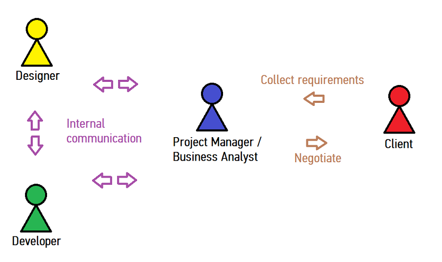

<aside class="notes"></aside>
# Think for yourself

## 2013-11-22 @CityU for Geekabond

<aside class="notes"></aside>
# Employee VS Freelancer

## Employee
<aside class="notes"></aside>

* Stable income and environment
* Staff benefits
* Annual leaves
* Stress comes from workload rather than decision making
* Routine
* Fixed career path

## Freelancer
<aside class="notes"></aside>

* Variable income and environment
* More freedom
* Not sure what to do next
* More exposure
* Irregular working hours and rest
* Require self-discipline more
* Stress from family

<aside class="notes"></aside>
# Why Web Development?

## Why Web Development?
<aside class="notes"></aside>

* Simple and small
* Intuitive requirements
* Short development cycle
* Opensource
* Generic with big community

<aside class="notes"></aside>
# How a freelance project works?

## How a freelance project works?
<aside class="notes"></aside>

<aside class="notes"></aside>
# What do you want to do?

## What do you want to do?
<aside class="notes"></aside>

* Dream?
* Goal?
* What are you looking for?

## Your motivation?
<aside class="notes"></aside>

* Money?
* Reputation?
* Career prospect?
* Happiness?
* Quality of work?
* Teammates?
* Working atmosphere?
* Interests?

<aside class="notes"></aside>
# What I want to do?